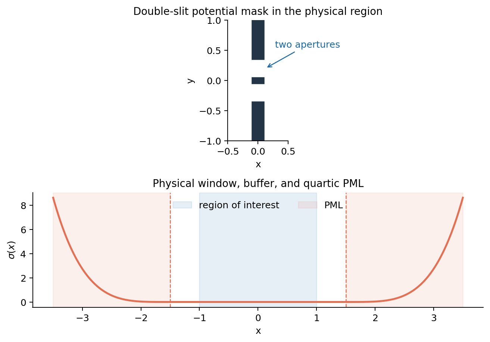
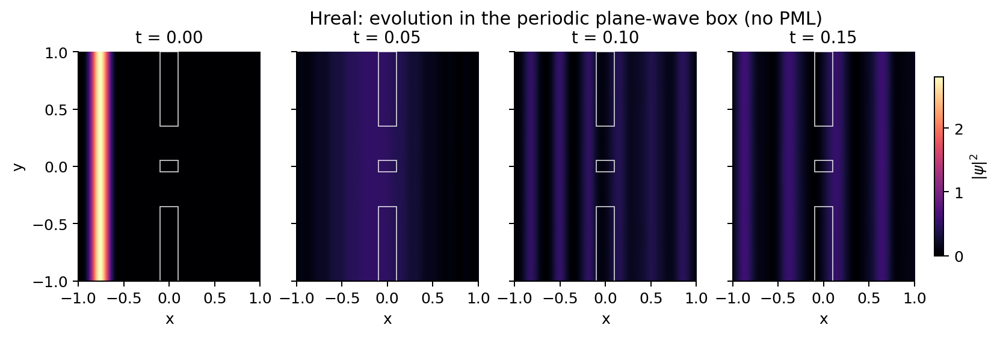
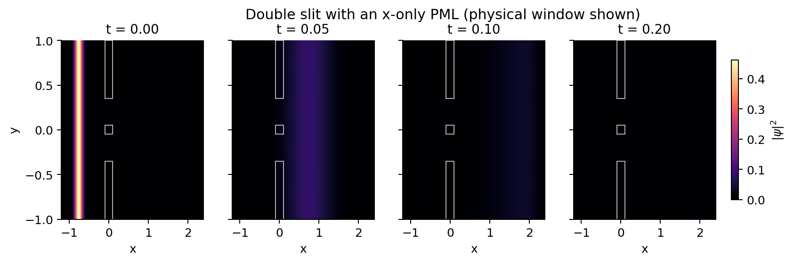
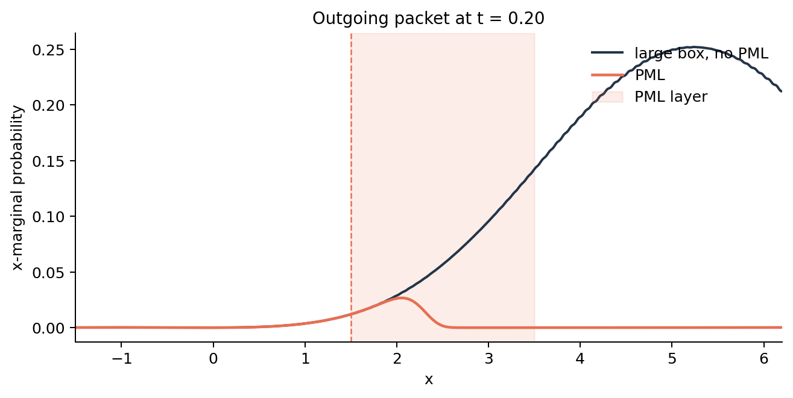
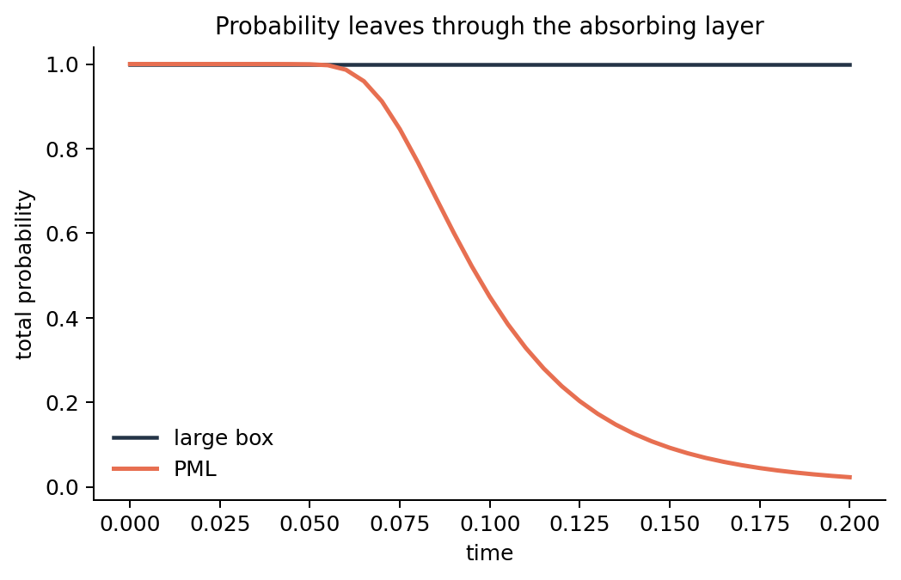
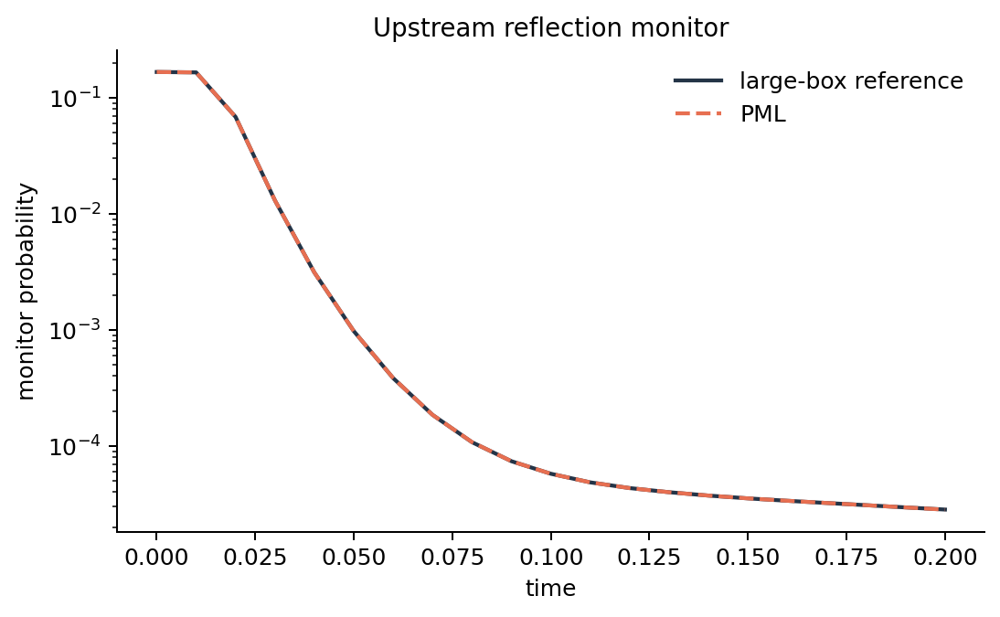
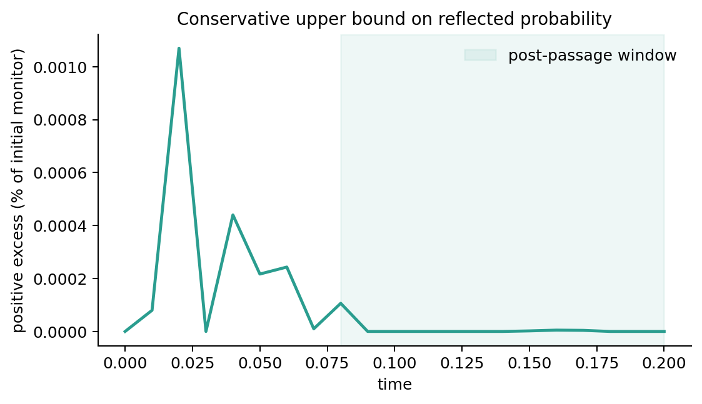
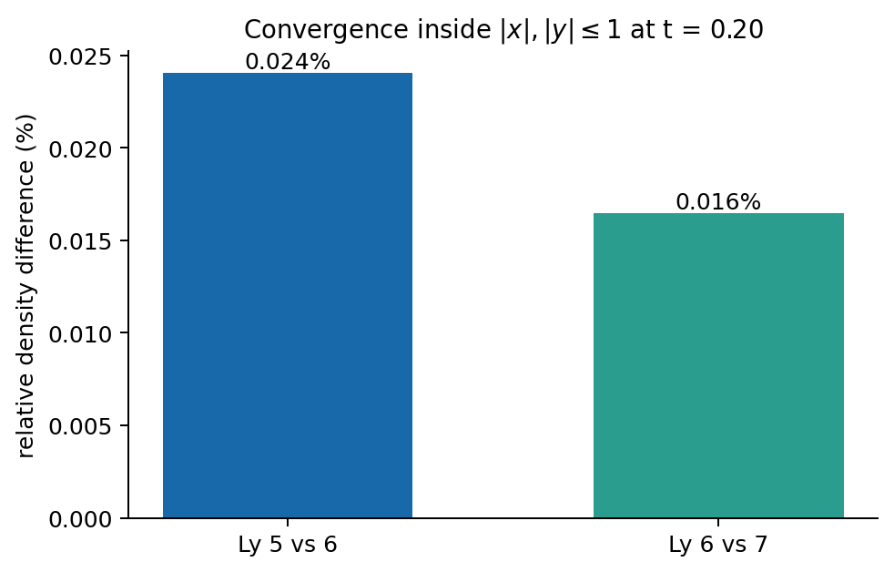

# 2D Double-Slit Schrödinger Equation with a Validated PML

[](https://github.com/sanvargasmo/double-slit-schrodinger-pml/actions/workflows/tests.yml)

This repository studies the time-dependent two-dimensional Schrödinger
equation for a double slit in a global plane-wave basis. It preserves the
Hamiltonian of the original `Hreal` calculation and adds a perfectly matched
layer (PML) without changing that basis.

The central numerical question is not merely whether probability decreases.
It is whether the outgoing wave is absorbed **without a measurable wave coming
back into the physical region**, and whether the remaining periodic y boundary
changes the result. Both effects are tested here against independent reference
calculations.



## Notebooks

- [`notebooks/Hreal.ipynb`](notebooks/Hreal.ipynb) — original plane-wave
  Hamiltonian and evolution in the periodic box, without PML.
- [`notebooks/Untitled28_PML.ipynb`](notebooks/Untitled28_PML.ipynb) — the same
  physical model with an x-only PML and the validated domain sizes.
- [`notebooks/Parameter_Explorer.ipynb`](notebooks/Parameter_Explorer.ipynb) —
  an editable configuration cell for testing different geometries, PMLs,
  spectral cutoffs, packets, and evolution times.

The notebooks are stored without outputs or Colab-specific metadata. The
already-generated figures below can therefore be inspected directly on GitHub
without running a notebook.

| No PML (`Hreal`) | With x-only PML |
| --- | --- |
|  |  |

## Model

Normalized plane waves are used on

$$[-L_x,L_x]\times[-L_y,L_y],\qquad
\phi_{nm}(x,y)=\frac{e^{i\pi nx/L_x}e^{i\pi my/L_y}}
{2\sqrt{L_xL_y}}.$$

The double-slit potential is a rectangular screen of thickness $b=0.20$ with
two apertures of width $a=0.30$ and centre-to-centre separation $c=0.40$. The
clean implementation is regression-tested element by element against the
explicit equations retained in `src/double_slit_pml/legacy_hreal.py`.

The complex stretch is applied only in x:

$$s(x)=1+i\sigma(x),\qquad
\partial_x^2\longrightarrow
\frac{1}{s^2}\partial_x^2-\frac{s'}{s^3}\partial_x.$$

The profile is exactly zero before the PML interface, so the differential
operator in the physical region is unchanged.

| Quantity | Validated value |
| --- | ---: |
| Region of interest | $|x|,|y|\leq1$ |
| PML direction | x only |
| PML start | $|x|=1.5$ |
| PML thickness | $2.0$ |
| Outer x boundary | $|x|=3.5$ |
| PML polynomial order | 4 |
| Design target | $R=10^{-3}$ |
| Selected transverse half-width | $L_y=6$ |
| Initial packet support | $-1<x<-0.525$ |
| Minimum packet-to-PML buffer | $0.5$ |

## Does the PML work?

Yes, for the simulated window $0\leq t\leq0.2$ and the stated spectral
cutoffs. Two checks support that conclusion.

First, a freely propagating packet is compared with a conservative box of
$L_x=8$. At $t=0.2$ the large box retains probability to numerical precision,
whereas the PML calculation retains only **2.308%** because the outgoing packet
has entered and been absorbed by the layer.





Second, an upstream monitor is placed at
$-1.4\leq x\leq-0.2$, $-1\leq y\leq1$. The positive PML-minus-reference excess
after the incident packet has left the monitor is treated as a conservative
upper bound on reflection.

- Free-packet benchmark: **$1.04\times10^{-6}$** of the initial monitor
  probability, or **0.000104%**.
- Full double-slit calculation: **$1.06\times10^{-6}$**, or **0.000106%**.
- The automated acceptance threshold is **0.03%**; the test passes by more
  than two orders of magnitude.

| Upstream monitor | Positive excess bound |
| --- | --- |
|  |  |

These figures also show why probability loss alone is not used as proof: the
large-box reference is needed to separate ordinary packet tails from a wave
returning from the absorbing boundary.

## Do the box boundaries affect the physical region?

The plane-wave basis makes the outer boundaries periodic rather than rigid.
In x, the periodic boundary is behind the PML, and the reflection monitor above
shows no significant return from it.

There is deliberately no PML in y. To test that boundary independently, the
same physical incident density and approximately the same transverse momentum
cutoff are used for $L_y=5,6,7$. Inside $|x|,|y|\leq1$ at $t=0.2$:

- $L_y=5$ versus $6$: **0.0241%** relative density difference.
- $L_y=6$ versus $7$: **0.0165%** relative density difference.



The selected value $L_y=6$ therefore keeps the observed transverse periodicity
effect below two hundredths of a percent relative to the $L_y=7$ calculation
for this time window.

## Test different parameters

The quickest interactive route is
[`notebooks/Parameter_Explorer.ipynb`](notebooks/Parameter_Explorer.ipynb).
Change only its **Parameters** cell and run the cells from top to bottom.

For repeatable command-line experiments, use
[`scripts/run_experiment.py`](scripts/run_experiment.py). The default command
uses the validated PML configuration and writes both a figure and a JSON file:

```bash
python scripts/run_experiment.py
```

Examples:

```bash
# Change the PML
python scripts/run_experiment.py \
  --pml-start 1.3 --pml-thickness 2.5 \
  --pml-order 6 --target-reflection 1e-4 \
  --output results/pml_order_6.png

# Change the double-slit geometry and incident packet
python scripts/run_experiment.py \
  --slit-width 0.25 --slit-separation 0.55 \
  --barrier-thickness 0.15 --barrier-height 3.0 \
  --k0 24 --t-final 0.30 \
  --output results/modified_slits.png

# Show nine density snapshots from t=0 through t=0.2
python scripts/run_experiment.py \
  --t-final 0.2 --snapshots 9 --plot-snapshots 9 \
  --plot-columns 3 \
  --output results/nine_snapshots.png

# Remove the PML and use a large reference box
python scripts/run_experiment.py \
  --no-pml --lx 8 --nx 183 \
  --output results/large_box.png
```

Run `python scripts/run_experiment.py --help` to see every available
parameter. The principal settings are:

| Group | Command-line parameters |
| --- | --- |
| Double slit | `--slit-width`, `--slit-separation`, `--barrier-thickness`, `--barrier-height` |
| PML | `--pml-start`, `--pml-thickness`, `--pml-order`, `--target-reflection` |
| Box and basis | `--lx`, `--ly`, `--nx`, `--ny`, `--pml` / `--no-pml` |
| Packet | `--packet-left`, `--packet-right`, `--k0` |
| Evolution | `--t-final`, `--snapshots` |
| Figure layout | `--plot-snapshots`, `--plot-columns`, `--density-normalization` |
| Plot window | `--view-x-min`, `--view-x-max`, `--view-y-min`, `--view-y-max` |

The default visualization uses `--density-normalization physical`. At each
displayed time it finds the maximum density in the displayed part of the domain
before the x-PML interface,
$\rho_{\max,\mathrm{phys}}(t)=\max_{\mathrm{phys}}|\psi(x,y,t)|^2$, and plots
$|\psi|^2/\rho_{\max,\mathrm{phys}}(t)$. Thus the physical-region peak is one
in every panel and the evolving pattern remains visible as its absolute
amplitude decreases. The unscaled peak used as the denominator is printed in
each panel. The lower plot still reports the integrated probabilities, so this
display rescaling cannot be mistaken for probability conservation.

Use `--density-normalization integral` for the conditional density
$|\psi|^2/P_{\mathrm{phys}}(t)$, or `--density-normalization absolute` for the
unscaled density.

## Reproduce the results

```bash
python -m venv .venv
source .venv/bin/activate
python -m pip install -e ".[dev]"
pytest
python scripts/generate_notebooks.py
python scripts/generate_figures.py
```

The figure script writes the exact reported numbers to
[`figures/validation_metrics.json`](figures/validation_metrics.json). The
workflow in [`.github/workflows/tests.yml`](.github/workflows/tests.yml) runs
the eight automated tests on every push and pull request.

## Repository layout

```text
notebooks/                  Hreal and validated PML notebooks
src/double_slit_pml/        plane-wave model and diagnostics
tests/                      eight regression and validation tests
scripts/run_experiment.py   configurable single-experiment runner
scripts/                    notebook and validation-figure regeneration
figures/                    GitHub-ready results and metrics
```

No software license is currently specified for this repository.
